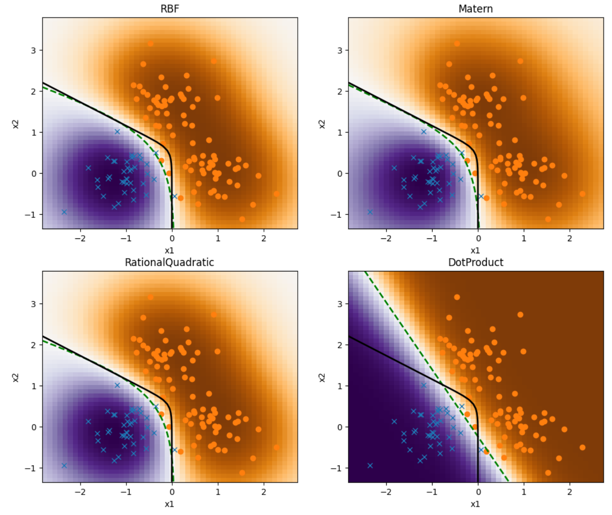

# Gaussian Process

## Kernel Functions
The figures below are the graphs and heatmaps of famous Kernel functions.

## Random functions created with Kernel Function
You can create various functions from the Kernel functions.

## Gaussian Process Regression
The dataset is created from $ \sin(2 \pi x)$ with Gaussian error.
Create a model by Gaussian Process Regression. The model can predict the target value with showing how much it has confident for the prediction as shown with the colored field in the graph below.

## Gaussian Process Classificatioin
You can extend the Gaussian Process Regression into Classification problem.
In the graph, the dataset was created by Gaussian. Gaussian Process Classification allows to classify these data with predicted probability. The black line is genuine border where the proability of $y = 0, 1$ is 0.5 and the green dashed line shows the predicted border by Gaussian Process Classification.
