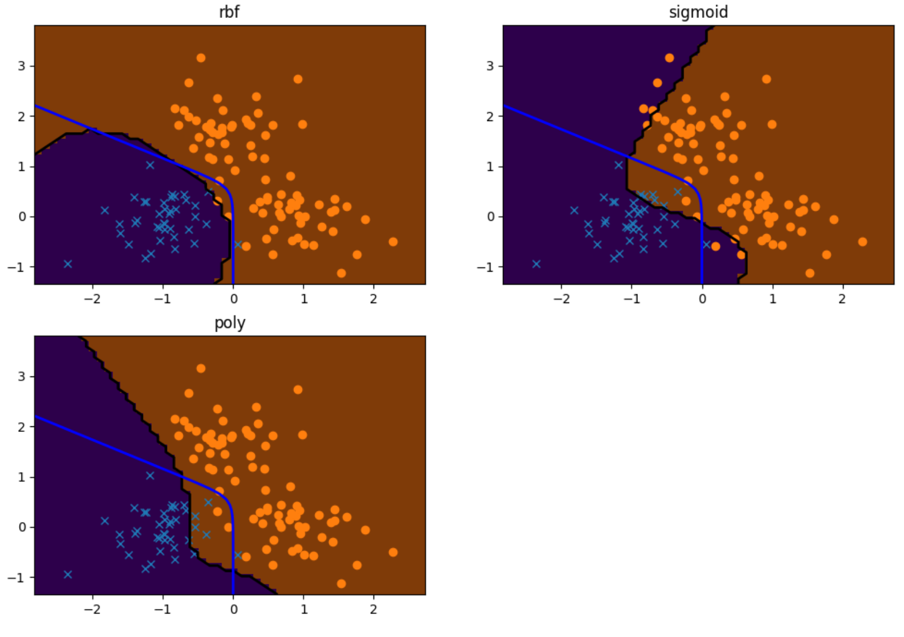

# Support Vector Machine

## Hard Margin
The randomly generated data was classified into two classes by using Hard-Margin Supprot Vector Machine (SVM) method.

The hyperparameter alpha is non zero for the data which is support vector (surrounded by green circles). All support vectors are on the margin boundaries.

## Soft Margin
The data created by gaussian was classified into two classes by using Soft-Margin Support Vector Machine (SVM) model.
Three types of kernel functions are used to compare. Each karnel gives different boundary.

