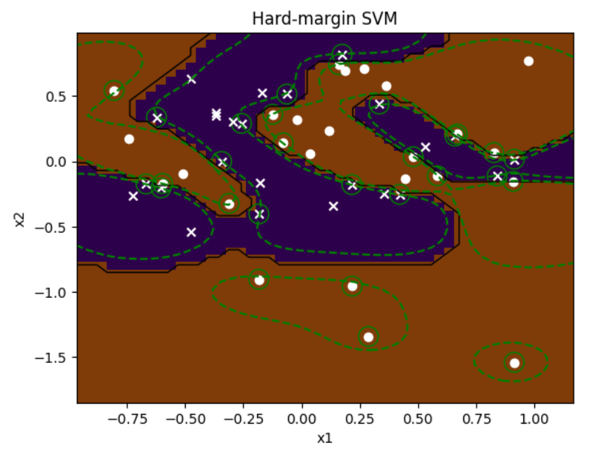
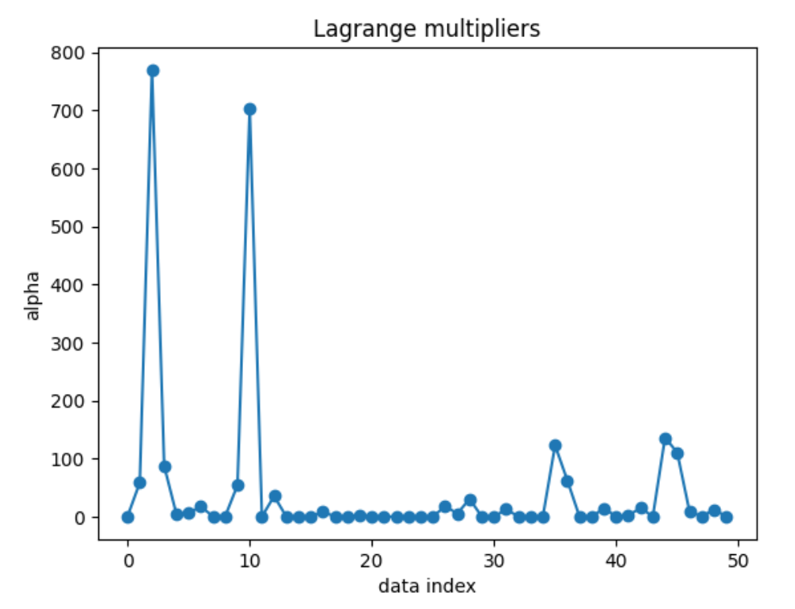

# Support Vector Machine

## Hard Margin
The randomly generated data was classified into two classes by using Hard-Margin Supprot Vector Machine (SVM) method.

The hyperparameter alpha is non zero for the data which is support vector (surrounded by green circles).

